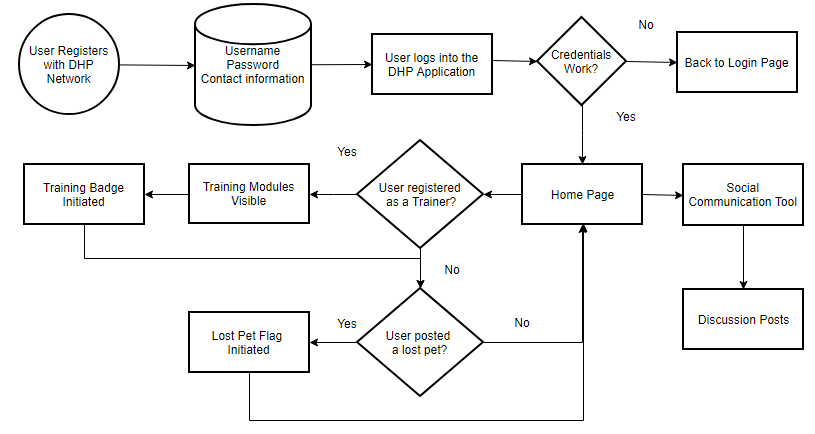

## Dogs Helping Pets Network Model - Behavior Diagram

The flowchart below describes how users interact with the DHP Network application. Important functions of the system include:

1. All users of the network have access to social communication and discussion posts
2. After a user has requested materials for training their dog for tracking lost pets, training resources are visible and their user status is changed to "Trainer"
3. After users have indicated in the system they are an owner of a lost pet, their status changes to "Owner of lost pet"
4. A user can have both "Trainer" and "Owner of lost pet" status

