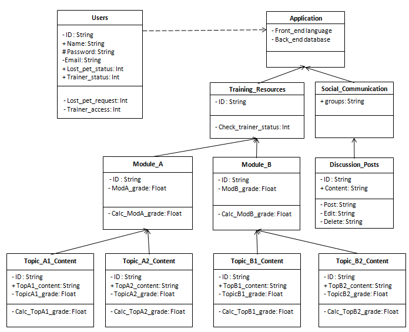

## Dogs Helping Pets Network Model - Class Diagram

The diagram displayed below is displayed similar to the Object Diagram, however details about the object blocks are shown.

Since the users need to register with the system, they will have attributes such as a username, password and email. A user who indicates they have a lost pet will trigger a function that sets their Lost_pet_status to TRUE. Similar attributes and functions will exist for dog owners who would like to be identified as trainers.

Training Resources are comprised of Modules, which in turn are made up of topical content. A user working through the topical content can complete quizes as they progress through the material. These quiz grades are calculated using functions like Calc_TopA1_grade. The topic content quiz grade score is housed in an attribute called TopicA1_grade and is linked with the user ID.

All users have access to discussion posts with functions of adding, editing and deleting.

