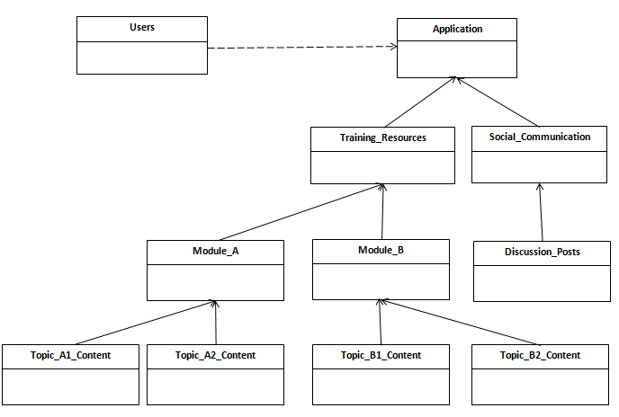

## Dogs Helping Pets Network Model - Object Diagram

The main blocks of the system include users and the application. Users can have different attributes and functions and will be discussed further in the Class Diagram. The Application is made up of two parts:

1. Training_Resources
2. Social_Communication

The blocks mentioned above directly tie to the goals of the DHP Network described .

Within the Training_Resources object, several modules with topical content can be accessed. For simplicity, we have provided two Modules (A and B) each with two topics. Users of the network also have access to Social_Communication, which is made up of discussion posts.

